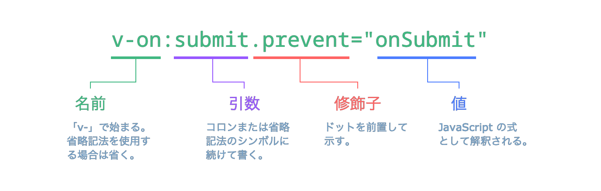

# テンプレート構文 {#template-syntax}

Vue では、HTML ベースのテンプレート構文を使用します。テンプレート構文では、基盤とするコンポーネントのインスタンスのデータと、レンダリングされる DOM を宣言的にバインドすることが可能です。すべての Vue テンプレートは、仕様に準拠しているブラウザーや HTML パーサーでパースできる、構文的に正規の HTML です。

内部では、Vue はテンプレートをコンパイルし、高度に最適化された JavaScript のコードにします。リアクティビティー機構と組み合わせ、Vue はアプリの状態が変化したとき、再レンダリングを必要とする最小限のコンポーネントをインテリジェントに見つけ出すことができます。そして、最小限の DOM 操作を適用します。

仮想 DOM の各種概念をよく知っていて、生の JavaScript が持つパワーを活かしたいという場合には、テンプレートの代わりに [レンダー関数を直接記述](/guide/extras/render-function)することもできます。さらに、オプションで JSX もサポートされています。ただし、これらの書き方をする場合には、コンパイル時の最適化がテンプレートと同等のレベルでは利用できないことに注意してください。

## テキスト展開 {#text-interpolation}

データバインディングで最も基本の形式は、「マスタッシュ構文」(二重中括弧) によるテキスト展開です:

```vue-html
<span>Message: {{ msg }}</span>
```

このマスタッシュのタグの中身は、[対応するコンポーネントのインスタンス](/guide/essentials/reactivity-fundamentals#declaring-reactive-state)が持つ `msg` というプロパティの値に置き換えられます。`msg` プロパティが変更されるたびに、マスタッシュの中身も更新されます。

## 生の HTML {#raw-html}

マスタッシュの中では、データが HTML ではなくプレーンテキストとして解釈されます。本来の HTML を出力したい場合は、次のように [`v-html` ディレクティブ](/api/built-in-directives#v-html)を用いる必要があります:

```vue-html
<p>Using text interpolation: {{ rawHtml }}</p>
<p>Using v-html directive: <span v-html="rawHtml"></span></p>
```

<script setup>
  const rawHtml = '<span style="color: red">This should be red.</span>'
</script>

<div class="demo">
  <p>Using text interpolation: {{ rawHtml }}</p>
  <p>Using v-html directive: <span v-html="rawHtml"></span></p>
</div>

ここで、新たな要素が登場しました。この例にある `v-html` という属性は、「**ディレクティブ**」と呼ばれるものです。ディレクティブは `v-` という接頭辞を持ち、Vue によって提供される特別な属性であることを示します。そしてご想像の通り、ディレクティブはレンダリングされる DOM に、特別なリアクティブな振る舞いを割り当てます。この例では、簡単に言うと、「現在アクティブなインスタンスが持つ `rawHtml` というプロパティをこの要素の inner HTML に適用して最新に保つ」ということが書かれています。

`span` の中身は `rawHtml` プロパティが持つ値に置き換えられ、プレーンな HTML として解釈されます。データバインディングは無視されます。`v-html` は、テンプレートの断片を組み立てるのには利用できないことに注意してください。これは、Vue が文字列ベースのテンプレートエンジンではないためです。それに代わり、UI の再利用や組み立ての基本単位として推奨されているのが「コンポーネント」です。

:::warning セキュリティーに関する警告
ウェブサイト上で任意の HTML を動的にレンダリングすることは、[クロスサイトスクリプティング (XSS) 脆弱性](https://ja.wikipedia.org/wiki/%E3%82%AF%E3%83%AD%E3%82%B9%E3%82%B5%E3%82%A4%E3%83%88%E3%82%B9%E3%82%AF%E3%83%AA%E3%83%97%E3%83%86%E3%82%A3%E3%83%B3%E3%82%B0)を招きやすく、非常に危険です。`v-html` は信頼できるコンテンツにのみ使用し、ユーザーから渡されるコンテンツには**決して**使用しないでください。
:::

## 属性バインディング {#attribute-bindings}

HTML 属性の中ではマスタッシュ構文が使えません。代わりに、以下の [`v-bind` ディレクティブ](/api/built-in-directives#v-bind)を使用します:

```vue-html
<div v-bind:id="dynamicId"></div>
```

この `v-bind` ディレクティブは、要素の `id` という属性を、コンポーネントが持つ `dynamicId` というプロパティと同期させるよう Vue に指示しています。バインドされた値が `null` または `undefined` の場合、その属性はレンダリングされる要素から除外されます。

### 省略記法 {#shorthand}

`v-bind` は使用頻度が非常に高いため、以下の専用の省略記法があります:

```vue-html
<div :id="dynamicId"></div>
```

`:` で始まる属性は、普通の HTML の記法とは少し異なるように見えますが、実際には属性名として有効な文字です。Vue をサポートするすべてのブラウザーは、これを正しく解析することができます。なお、これは最終的にレンダリングされるマークアップには現れません。この省略記法を使うかどうかは任意ですが、その使い方を後ほど詳しく知れば、良さがわかるはずです。

> このガイドの残りの部分では、Vue を用いる開発者にとって最も一般的な書き方である省略記法をコード例のなかで使用します。

### ブーリアン属性 {#boolean-attributes}

[ブーリアン属性](https://html.spec.whatwg.org/multipage/common-microsyntaxes.html#boolean-attributes)は、要素に含まれるかどうかによって「真」または「偽」の値を表す属性です。例えば、[`disabled`](https://developer.mozilla.org/ja/docs/Web/HTML/Attributes/disabled) は最も一般的に用いられるブーリアン属性の 1 つです。

以下のケースでは、`v-bind` は少し特別な動作をします:

```vue-html
<button :disabled="isButtonDisabled">Button</button>
```

この `disabled` という属性は、`isButtonDisabled` が [真値 (truthy value)](https://developer.mozilla.org/ja/docs/Glossary/Truthy) である場合に要素に含まれます。また、`<button disabled="">` との一貫性を保つため、値が空の文字列である場合にも含まれます。それ以外の[偽値 (falsy values)](https://developer.mozilla.org/ja/docs/Glossary/Falsy) の場合には、属性が要素から取り除かれます。

### 複数の属性を動的にバインドさせる {#dynamically-binding-multiple-attributes}

次のような複数の属性を持つ JavaScript オブジェクトがあるとします:

<div class="composition-api">

```js
const objectOfAttrs = {
  id: 'container',
  class: 'wrapper'
}
```

</div>
<div class="options-api">

```js
data() {
  return {
    objectOfAttrs: {
      id: 'container',
      class: 'wrapper'
    }
  }
}
```

</div>

以下のように `v-bind` を引数なしで用いると、これらの複数の属性を 1 つの要素にバインドすることができます:

```vue-html
<div v-bind="objectOfAttrs"></div>
```

## JavaScript の式を用いる {#using-javascript-expressions}

ここまで、テンプレート内のプロパティのキーに単純なバインドを行う方法だけを見てきました。しかし、実は Vue ではあらゆるデータバインディングにおいて、以下のように JavaScript 式のフルパワーを活用することができます:

```vue-html
{{ number + 1 }}

{{ ok ? 'YES' : 'NO' }}

{{ message.split('').reverse().join('') }}

<div :id="`list-${id}`"></div>
```

これらの式は、現在のコンポーネントインスタンスのデータスコープ内で、JavaScript の式として評価されます。

Vue のテンプレートでは、以下の場所で JavaScript の式を使用することができます:

- テキスト展開の内部 (マスタッシュ構文内)
- 任意の Vue ディレクティブ (`v-` で始まる特殊な属性) の属性値の中身

### 式に限られる {#expressions-only}

それぞれのバインディングには、**単一の式**しか含めることができません。式とは、ある値に対して評価されるコードの一部分です。簡単なチェックは、`return` の後に使えるかどうかです。

そのため、以下はうまく**動作しません**:

```vue-html
<!-- これは文であり、式ではありません: -->
{{ var a = 1 }}

<!-- フロー制御も動作しません。代わりに三項演算子を使用してください。 -->
{{ if (ok) { return message } }}
```

### 関数の呼び出し {#calling-functions}

コンポーネントから公開されているメソッドであれば、以下のようにバインディングの式の内部で呼び出すことができます:

```vue-html
<time :title="toTitleDate(date)" :datetime="date">
  {{ formatDate(date) }}
</time>
```

:::tip
バインディングの式の内部で呼び出される関数は、コンポーネントが更新されるたびに呼び出されます。そのため、データの変更や非同期処理をトリガーするような副作用を持たせては**いけません**。
:::

### グローバルへのアクセスの制限 {#restricted-globals-access}

テンプレートで用いる式はサンドボックス内で実行され、[限定的なグローバルのリスト](https://github.com/vuejs/core/blob/main/packages/shared/src/globalsAllowList.ts#L3)にのみアクセスできます。このリストには、`Math` や `Date` などのよく使われる組み込みグローバルが含まれています。

ユーザーが `window` に付与したプロパティなど、このリストに明示的に含まれていないグローバルには、テンプレート内の式からアクセスすることができません。ただし、[`app.config.globalProperties`](/api/application#app-config-globalproperties) に追加することにより、Vue のあらゆる式で利用できるグローバルを明示的に定義することができます。

## ディレクティブ {#directives}

ディレクティブは、`v-` という接頭辞を持つ特別な属性です。Vue では、上で紹介した `v-html` や `v-bind` をはじめ、数々の[組み込みディレクティブ](/api/built-in-directives)が用意されています。

ディレクティブの属性値は、JavaScript の単一の式であることが期待されます (ただし `v-for`、`v-on`、`v-slot` は例外であり、後ほどそれぞれのセクションで説明します)。ディレクティブの役割は、式が示す値が変化したとき、リアクティブに更新を DOM に適用することです。例えば、[`v-if`](/api/built-in-directives#v-if) を取り上げてみます:

```vue-html
<p v-if="seen">Now you see me</p>
```

この例では、`v-if` というディレクティブを用いて、式 `seen` が示す値の真偽に基づいて要素 `<p>` を削除したり挿入したりします。

### 引数 {#arguments}

一部のディレクティブは引数を取ることができます。引数は、ディレクティブ名の後にコロンで示します。以下は、`v-bind` ディレクティブを使って HTML 属性の 1 つをリアクティブに更新する例です:

```vue-html
<a v-bind:href="url"> ... </a>

<!-- 省略記法 -->
<a :href="url"> ... </a>
```

この例では `href` が引数です。これにより、要素の `href` という属性を `url` という式の値にバインドするという指示が `v-bind` ディレクティブに伝えられます。省略記法では、引数の前に置かれる部分（つまり `v-bind:`）がすべて `:` という 1 文字に凝縮されます。

別の例として、DOM イベントを購読する `v-on` ディレクティブを紹介します:

```vue-html
<a v-on:click="doSomething"> ... </a>

<!-- 省略記法 -->
<a @click="doSomething"> ... </a>
```

この例では、引数は購読するイベント名の `click` です。`v-on` には対応する省略形があり、`@` という文字です。イベントのハンドリングについても、後ほど詳しく説明します。

### 動的引数 {#dynamic-arguments}

ディレクティブの引数を指す部分では、以下のように角括弧で囲んだ JavaScript の式を用いることもできます:

```vue-html
<!--
引数で使用できる式には、いくつか制約があります。詳細は以下の
「動的引数の値に関する制約」および「動的引数の構文上の制約」セクションで説明します。
-->
<a v-bind:[attributeName]="url"> ... </a>

<!-- 省略記法 -->
<a :[attributeName]="url"> ... </a>
```

この例では、`attributeName` が JavaScript の式として動的に評価され、そこで評価された値が最終的な引数を指す値として使用されます。例えば、コンポーネントのインスタンスが `attributeName` というデータプロパティを持ち、その値が `"href"` のとき、このバインディングは `v-bind:href` と同等になります。

同じように、動的引数を用いてハンドラーを動的なイベント名にバインドすることもできます:

```vue-html
<a v-on:[eventName]="doSomething"> ... </a>

<!-- 省略記法 -->
<a @[eventName]="doSomething">
```

この例では、`eventName` の値が `"focus"` のとき、`v-on:[eventName]` が `v-on:focus` と同等になります。

#### 動的引数の値に関する制約 {#dynamic-argument-value-constraints}

動的引数は、評価結果が `null` または文字列のいずれかになることが期待されます。`null` は特別な値で、バインディングを削除することを明示的に表します。それ以外の非文字列の値を指定すると、警告が発生します。

#### 動的引数の構文上の制約 {#dynamic-argument-syntax-constraints}

動的引数の式には、構文上の制約がいくつかあります。これは、スペースや引用符など特定の文字が HTML の属性名の中では無効となるためです。例えば、次のようなものは無効となります:

```vue-html
<!-- この場合、コンパイラーで警告が発生します。 -->
<a :['foo' + bar]="value"> ... </a>
```

複雑な動的引数を渡す必要がある場合は、後ほど取り上げる[算出プロパティ](./computed)を使用するとよいでしょう。

また、HTML ファイルに直接記述する DOM 内テンプレートを使用する場合、ブラウザーでは属性名が小文字であることが求められるため、以下のように大文字のキー名を使用することは避ける必要があります:

```vue-html
<a :[someAttr]="value"> ... </a>
```

上のコードは、DOM 内テンプレートでは `:[someattr]` に変換されます。もしコンポーネントに `someattr` ではなく `someAttr` というプロパティしかなければ、このコードは動作しません。単一ファイルコンポーネント内のテンプレートは、この制約の対象**外**です。

### 修飾子 {#modifiers}

修飾子は、ドット (.) で示される特別な接頭辞で、ディレクティブを何らかの特別な方法でバインドすることを表します。例えば、以下に示す `.prevent` という修飾子は、イベントがトリガーされたときに `event.preventDefault()` を呼び出すことを `v-on` ディレクティブに伝えます:

```vue-html
<form @submit.prevent="onSubmit">...</form>
```

この後、[`v-on` 向け](./event-handling#event-modifiers)や [`v-model` 向け](./forms#modifiers)の修飾子の例を、その機能のページで見ることになるでしょう。

最後に、ディレクティブの構文の全容をこちらの図にまとめました:



<!-- https://www.figma.com/file/BGWUknIrtY9HOmbmad0vFr/Directive -->
